# 淘宝闪购Flink+Fluss湖流一体落地：支撑千亿级流量的实时决策闭环

> 作者： 淘宝闪购-DIC数据智能中心-流量数据研发组 王浩迪(湛知)

2025 年秋，“秋天第一杯奶茶”再度引爆社交网络。消费者指尖轻点，一杯饮品半小时内送达。这看似简单的瞬间，折射出淘宝闪购已从单一餐饮外卖，进化为覆盖生鲜、3C、美妆等全场景的高频核心业务。业务模式演进为“日常高频消费 + 活动峰值爆发”双轮驱动：日常场景下，活动窗口压缩至分钟级，百万级商品需实时响应；活动期间，流量与订单呈指数级跃升。在极致节奏下，“实时”已成为运营决策、算法迭代与质量监控的生命线：运营需 30 秒内刷新访购率与转化漏斗，算法要求订单预估模型分钟级迭代，质量侧则需灰度差异秒级可见、异常秒级报警。

而支撑这套高实时性体系的传统数据链路，长期运行在阿里内部消息队列 TimeTunnel (TT)+Flink+Paimon+StarRocks 架构上，随着业务规模持续膨胀，维表 State 膨胀、宽表拼接复杂、湖仓同步资源消耗高三大核心矛盾愈发突出，甚至形成了时效性、一致性、成本效率的“不可能三角”。引入 Fluss 后，通过其 Delta Join、Partial Update、湖流一体、列裁剪、自增列特性的协同落地，系统性解决了传统链路的痛点，重塑了实时决策数据链路的架构范式。

---

## 一、业务痛点与技术挑战：实时数据的“不可能三角”困局

淘宝闪购的实时数据体系，需稳定处理超大规模、极高并发的实时数据流，同时构建跨多业务域的实时宽表，并支撑页面访问流与订单流的实时关联、灰度监控等核心链路，对时效性、一致性、成本效率与系统扩展性提出极致要求。但在传统技术栈下，这四大维度的挑战相互交织，最终形成了时效、一致性、成本效率难以兼顾的“不可能三角”。其核心根源在于存储层的流批割裂：TimeTunnel（TT）作为消息队列代表“流”侧抽象，Paimon 作为湖仓格式代表“批”侧抽象，两者之间需依赖大量 Flink ETL Job 充当“胶水层”。每增加一层胶水，便叠加一次延迟、成本与一致性风险。

### 1.1 四大核心业务问题
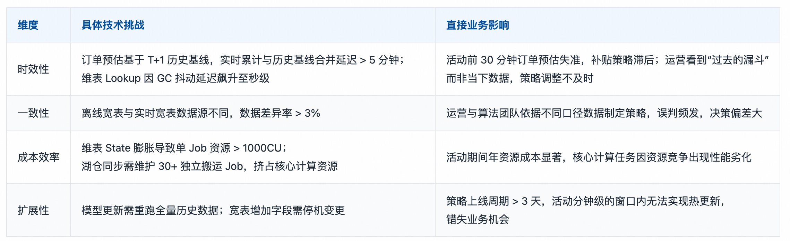

### 1.2 传统技术栈的三大核心痛点

基于 TT+Flink+Paimon 的传统链路，在闪购海量高并发、高实时性的场景下，暴露出的痛点具体可归结为三类，也是后续 Fluss 落地的核心攻坚点：

1. 双流 Join 内存压力剧增：TT 无法原生支持维表，订单信息需全量加载进 Flink State，活动期间亿级订单导致单作业状态体积激增至数百 GB 级别，引发 Checkpoint 超时及任务频繁失败；
2. 宽表拼接链路呈“爆炸树”结构：品店分析宽表依赖 5+ 上游系统，通过 TT 拼接需每跳 Join 后写入新 Topic，链路复杂且运维成本极高；
3. 湖仓同步额外消耗核心资源：每张落 Paimon 的表都需维护独立 Flink 消费 Job，活动期间同时运行几十个“搬运”Job，与核心计算任务争夺资源，导致整体性能下降。
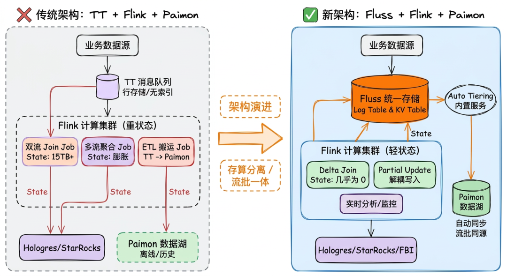

### 1.3 架构选型逻辑：从“计算层缝合”到“存储层统一”

基于上述的"不可能三角"困局，我们在技术选型时确立了一条核心原则：破局点不在计算层，而在存储层。传统架构依赖 TT（消息队列）+ Flink + Paimon（湖仓格式） 的组合，本质是"流批割裂"的拼接模式。Flink 作为计算引擎被迫承担大量"胶水"职责：维护 TB 级 State、调度数十个搬运 Job、处理双流 Join 的内存膨胀。这不仅推高了资源成本，更使数据一致性难以保障。

Fluss 的设计哲学恰好击中这一痛点：存储层的流批统一。它并非另一个消息队列，而是将流式消费与批式查询收敛至同一套分布式存储内核。流和批操作无需数据复制、无需格式转换、无需额外 ETL Job 搬运。这一底层架构的转变，直接消除了传统链路中"延迟、成本、一致性风险"的三大来源，为后续核心特性的落地提供了统一基座。

---

## 二、Fluss 核心场景落地实践：从理论到生产的全链路实现

淘宝闪购基于 Fluss 的五大核心特性，结合业务实际场景，设计了三层整体架构和五大场景特性组合矩阵，将 Fluss 作为实时决策的统一数据基座，打通从数据源采集、流批计算、湖仓存储到业务服务的全链路，实现各场景痛点的精准解决。

### 2.1 三层整体架构

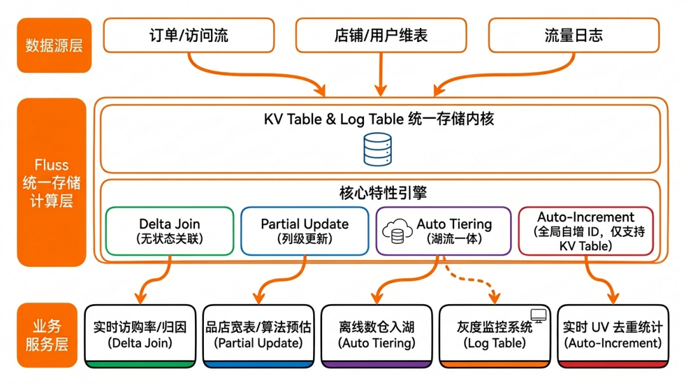

Fluss 落地后的闪购实时数据体系，分为数据源层、Fluss 存储计算层、业务服务层，三层架构基于流批统一的核心思想，实现数据的 “一次写入、多端复用”，彻底消除传统链路的流批割裂和胶水层 ETL。 

- 数据源层：整合订单流、访问流、商品维表、库存价格流等所有业务数据源，统一写入 Fluss 的 Log Table 或 KV Table，适配不同数据源的写入特性； 
- Fluss 存储计算层：作为核心层，基于 Fluss 的 Log Table/KV Table 实现数据的统一存储，通过 Delta Join、Partial Update、湖流一体等特性完成实时计算、多表关联、宽表构建、湖仓同步，同时为 Flink 提供无状态的计算支撑； 
- 业务服务层：基于 Fluss 和湖仓存储（Paimon）的统一数据视图，为运营实时看板、算法订单预估模型、灰度监控系统、品店分析系统等提供数据服务，实现秒级决策支撑。
### 2.2 五大场景特性组合矩阵

针对闪购实时访购率（订单归因）、品店实时宽表、实时订单预估、灰度监控、全域实时UV统计五大核心业务场景，结合各场景的核心问题，设计了专属的 Fluss 特性组合方案，实现痛点的精准解决，各场景的特性组合与替代组件，以及收益如下：

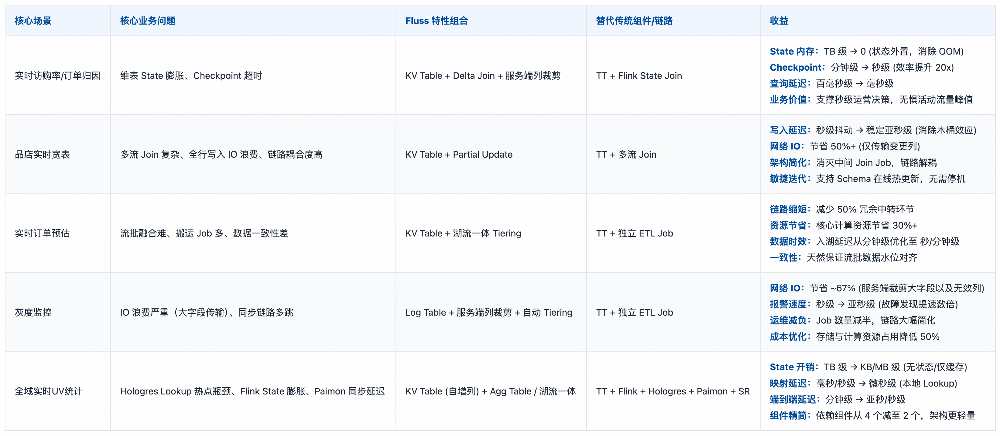

在淘宝闪购引入 Fluss 的过程中，我们进行了一些初步的探索与实践。除了对单点特性的试点验证外，我们重点在五大核心场景中尝试了架构层面的调整与工程化适配，并积累了一定的线上数据反馈。本文梳理了这些场景的落地细节与初步成效，希望能为大家提供一些参考。

---

## 三、场景1：实时访购率/订单归因 —— Delta Join 解决双流 Join State 膨胀

访购率（下单用户数 / 访问用户数）是衡量闪购转化效率的核心指标，其计算依托于实时用户访问流与订单流的关联，进而直接支撑闪购运营的秒级决策。

### 3.1 传统方案痛点

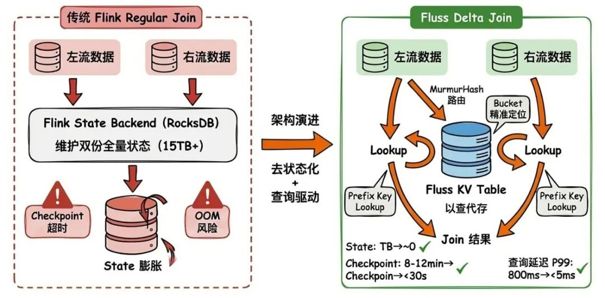

在旧方案下，Flink Regular Join 就像一个必须记住所有历史对话的客服：为了等待订单与浏览记录匹配，它必须在本地状态中持续累积所有未过期的事件。这导致了一个架构困境：想要更长的转化观察期，就必须付出线性增长的存储代价，让系统在面对大规模数据时面临状态膨胀、Checkpoint 耗时增加、反压风险上升等挑战。

- 活动期间千亿级访问日志需长窗口留存，单 Job 总 State 突破TB级，导致RocksDB Compaction 压力剧增、Checkpoint 耗时极长；
- State 读写放大导致磁盘 I/O 饱和与严重反压，实时归因延迟从秒级劣化至分钟级，访购率指标严重滞后；
- Checkpoint 耗时从分钟级劣化至 10~15 分钟，频繁出现超时失败，任务故障恢复（RTO）耗时数十分钟；
- 有效关联时间窗口受限于本地存储容量，无法支撑“浏览 - 下单”长周期转化归因，导致大量长尾交易数据丢失。
### 3.2 基于 Fluss Delta Join 的架构设计

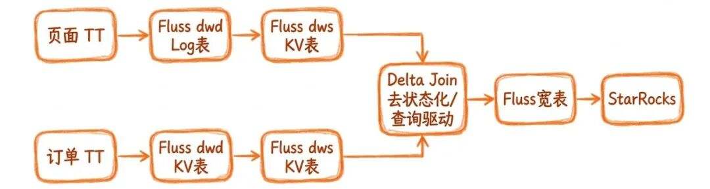

针对传统方案的痛点，我们的方案是将传统 Flink 双流关联升级为 Delta Join，把原本存储在 Flink State 中的双流数据全量转移至 Fluss KV Table 的 RocksDB 中，通过双向 Prefix Lookup（任意一侧有数据到来时，去对侧 KV Table 查询对应记录）实现近无状态的双流关联，同时通过 MurmurHash 分桶路由和列裁剪进一步提升查询性能。

- 实时订单流写入 Fluss KV Table（PRIMARY KEY (user_id,ds,order_id)，bucket.key = 'user_id'），实时流量访问日志写入 Fluss KV Table（PRIMARY KEY (user_id, ds)，bucket.key = 'user_id'）；两张表均采用复合主键设计，连接键（user_id）作为 bucket.key，且必须是主键的严格前缀，以支持 Prefix Lookup；
- Flink 2.1+ 通过 Delta Join 算子实现双流的双向关联——订单流到来时查询访问日志表，访问日志到来时查询订单表；Lookup 请求由 Flink 通过 MurmurHash(bucket.key) 计算目标 bucketId，精准定向 RPC 到持有该 bucket 的单个 Fluss TabletServer 的 RocksDB，无需广播全量扫描；Flink 算子本身仅保留极少量瞬态操作状态（异步 Lookup 队列），消除对 Join State 的依赖；
- 关联结果写入 Fluss 宽表，同时通过湖流一体自动同步至 Paimon，最终对接 StarRocks 和 BI实时看板，实现 30 秒内指标刷新。
### 3.3 核心 DDL 与关联 SQL 实现

-- 注：文中 ${xxx} 为环境相关参数，实际部署需根据集群规模与数据量评估。

-- 订单流（右表）
CREATE TABLE `fluss_catalog`.`db`.`order_ri` (
    order_id STRING,
    user_id STRING,
    order_time STRING,
    pay_amt STRING,
    ds STRING,
    PRIMARY KEY (user_id, ds, order_id) NOT ENFORCED
) PARTITIONED BY (ds)
WITH (
    'bucket.key' = 'user_id',
    'bucket.num' = '${BUCKET_NUM}',
    'table.auto-partition.enabled' = 'true',
    'table.auto-partition.key' = 'ds'
);

-- 访问流（左表）
CREATE TABLE `fluss_catalog`.`db`.`log_page_ri` (
    user_id STRING,
    first_page_time STRING,
    pv BIGINT,
    ds STRING,
    PRIMARY KEY (user_id, ds) NOT ENFORCED
) PARTITIONED BY (ds)
WITH (
    'bucket.key' = 'user_id',
    'bucket.num' = '${BUCKET_NUM}',
    'table.auto-partition.enabled' = 'true',
    'table.auto-partition.key' = 'ds'
);

-- sink
CREATE TABLE `fluss_catalog`.`db`.`log_page_ord_detail_ri`
(
    `user_id`       STRING comment '用户 ID',
    `order_id`      STRING comment '订单 ID',
    `first_page_time` STRING comment '首次访问时间',
    `order_time`    STRING comment '下单时间',
    `pv`            BIGINT comment '访问次数',
    `pay_amt`       STRING comment '支付金额',
    `is_matched`    STRING comment '是否匹配成功',
    `ds`            STRING comment '日期',
   PRIMARY KEY (user_id, order_id, ds) NOT ENFORCED
)
COMMENT '归因结果表'
PARTITIONED BY (ds)
WITH (
    'bucket.key' = 'user_id,order_id',
    'bucket.num' = '${BUCKET_NUM}',
    'table.auto-partition.enabled' = 'true',
    'table.auto-partition.key' = 'ds',
    'table.datalake.enabled' = 'true', -- 是否启用湖流一体
    'table.datalake.freshness' = '3min' -- 控制湖表新鲜度
);
然后，数据湖分层服务会持续将数据从Fluss分层到Paimon。参数table.datalake.freshness控制Fluss向Paimon表写入数据的频率。默认情况下，数据新鲜度为3分钟。Delta Join关联实现如下：

CREATE TEMPORARY VIEW matched_page_ord_detail AS
SELECT 
    l.ds,
    l.user_id,
    l.first_page_time,
    l.pv,
    o.order_id,
    o.order_time,
    CASE WHEN o.order_time >= l.first_page_time THEN '1' ELSE '0' END AS is_matched
FROM `fluss_catalog`.`db`.`log_page_ri` l
LEFT JOIN `fluss_catalog`.`db`.`order_ri` o 
    ON l.user_id = o.user_id AND l.ds = o.ds
;
Fluss支持两种TTL机制：

- Changelog过期：由 table.log.ttl 控制（默认7天）
- 数据分区过期：由 table.auto-partition.num-retention 控制（默认7个分区）
### 3.4 落地效果量化

Fluss Delta Join 方案实现了维表 Join 的无状态化，彻底解决了 State 膨胀问题，核心指标实现数量级提升：

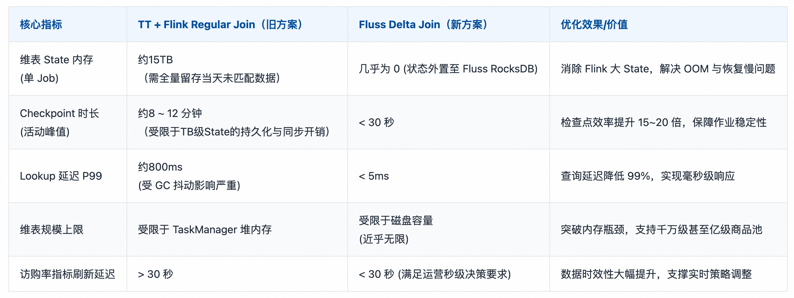
---

## 四、场景2：品店实时宽表——Partial Update 实现列级高效更新

在淘宝闪购的流量运营体系中，品店实时统计宽表是流量域最核心的数据资产。该宽表需实时汇聚曝光、点击、访问、下单四大核心行为流，从“品”和“店”两个维度输出关键指标（如：曝光 UV/PV、点击 UV/PV、访问 UV/PV、下单 UV、GMV 等），直接支撑实时的流量看板、ROI 分析、算法特征工程及活动作战室决策。面对超大规模与极高并发带来的行为日志流量压力，传统基于“多流 Join"的实时聚合模式面临着状态膨胀严重、链路耦合度高、容错性差等严峻挑战。Fluss 通过 Partial Update（局部更新） ，将原本复杂的“多流实时 Join 聚合”重构为“多流独立写入、服务端自动列级合并”，实现了实时宽表构建链路的简化与性能跃升。

### 4.1 传统方案痛点

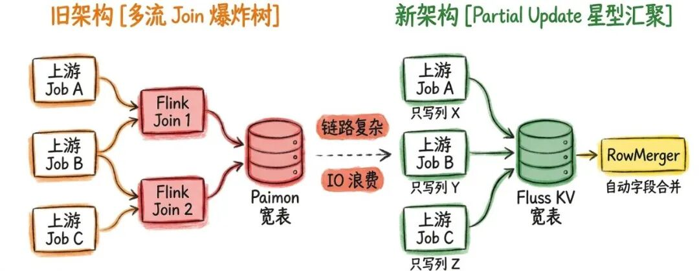

旧方案基于 TT 多流 Join 实现宽表构建，链路呈 “多路汇聚” 结构，核心痛点如下： 

- 全行写入 IO 浪费：哪怕仅有“点击”或“曝光”单类行为数据更新，也需携带 100 + 列全字段写入，网络与存储 IO 冗余严重； 
- 链路复杂运维成本高：需维护 N 个上游 Job+M 个 Join Job，链路呈 “爆炸树” 结构，新增字段需修改多个 Job； 
- 上游延迟影响整行：宽表写入延迟由最慢的上游决定，任意一路数据迟到都会导致整行数据延迟； 
- State 膨胀与热更困难：为等待不同行为流的数据匹配以计算转化率，Flink 需在本地 State 缓存海量中间状态，导致 TB 级状态膨胀、Checkpoint 超时及 OOM 风险。同时，因强耦合的 Join 逻辑，无法支持活动期间的字段热更新，扩容或改模型需停机重跑。
### 4.2 基于 Fluss Partial Update 的架构设计

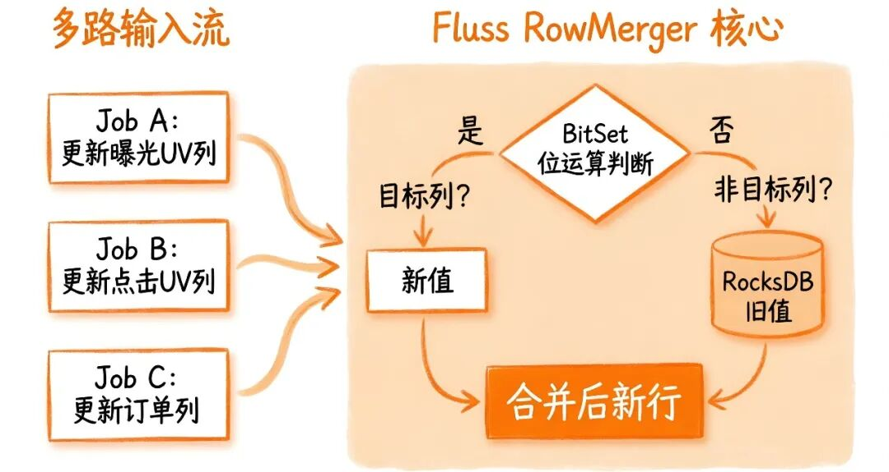

针对上述痛点，我们的方案是用 Fluss KV Table 作为品与店双维度统计宽表的统一存储，通过 Partial Update 实现列级更新，将曝光、点击、访问、下单等不同行为流的写入完全解耦。各 Flink Job 仅负责自身行为指标的聚合与目标列写入，无需进行复杂的多流 Join，由 Fluss 服务端的 RowMerger 自动完成字段级合并。核心架构流程如下：

- 多流独立聚合写入：5+ 个上游行为流（曝光、点击、访问、加购、下单）分别运行独立的 Flink Job。每个 Job 仅消费单一行为日志，按“品”或“店”维度预聚合后，仅写入宽表中对应的指标列，彻底消除流间依赖。
- 服务端智能列级合并：Fluss 利用 Partial Update 特性，基于 BitSet 位图技术识别写入请求中的目标列。在存储引擎内部，仅读取并更新目标列数据（执行累加或覆盖），非目标列直接保留 RocksDB 中的历史旧值，无需在网络和内存中传输冗余数据，实现微秒级合并。
- 湖流一体自动同步：合并后的最新宽表数据实时对外提供低延迟点查（Get）和流式消费能力；同时通过 自动 Tiering 机制，异步将数据分层同步至 Paimon 湖仓，无需额外开发 ETL 搬运任务，即可支撑离线 T+1 校验、历史回溯及 AI 模型训练。
- Schema 在线热演化：当业务需要新增统计指标时，仅需执行 ALTER TABLE ADD COLUMN 修改 DDL，新建一个针对该列的写入 Job 即可生效。无需停机、无需重启现有的曝光、下单等其他 Job，可以支持活动期间的敏捷迭代。
### 4.3 核心 DDL 与分 Job 写入实现

CREATE TABLE shop_stat_wide (
    shop_id      BIGINT NOT NULL,
    stat_date    STRING NOT NULL,
    stat_hour    STRING NOT NULL,
    exp_cnt      BIGINT,
    page_cnt     BIGINT,
    PRIMARY KEY (shop_id, stat_date, stat_hour) NOT ENFORCED
) WITH (
    'bucket.num' = '${BUCKET_NUM}',
    'bucket.key' = 'shop_id'
);

-- 写入曝光数据
INSERT INTO shop_stat_wide (shop_id, stat_date, stat_hour, exp_cnt)
SELECT shop_id, stat_date, stat_hour, sum(exp_cnt) as exp_cnt
FROM exposure_log
GROUP BY shop_id, stat_date, stat_hour;

-- 写入访问数据
INSERT INTO shop_stat_wide (shop_id, stat_date, stat_hour, page_cnt)
SELECT shop_id, stat_date, stat_hour, sum(page_cnt) as page_cnt
FROM page_log
GROUP BY shop_id, stat_date, stat_hour;
### 4.4 落地效果量化

Fluss Partial Update 方案实现了宽表的列级更新和解耦写入，核心指标实现大幅优化，同时降低了运维成本：

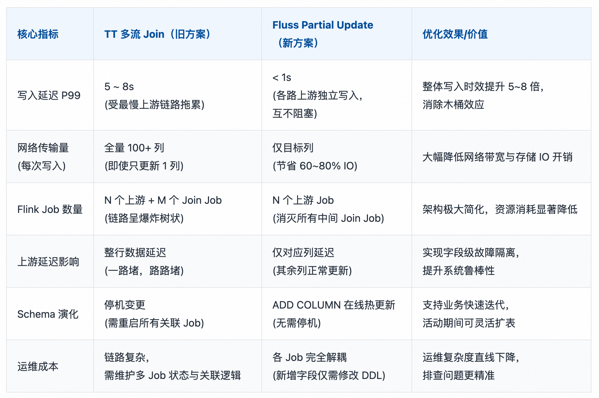

---

## 五、场景3：实时订单预估——Fluss KV 湖流一体实现高效数据融合

实时订单预估是淘宝闪购算法决策体系中的重要支撑环节。在活动期间，系统需每分钟迭代一次预测模型，精准推算全天大盘 GMV，从而动态调整补贴策略与库存分配。该场景对数据链路提出了极致挑战：模型输入必须深度融合实时累计订单流（高频增量）与历史同期基线数据（海量存量），对数据一致性和实时性要求极高。 

!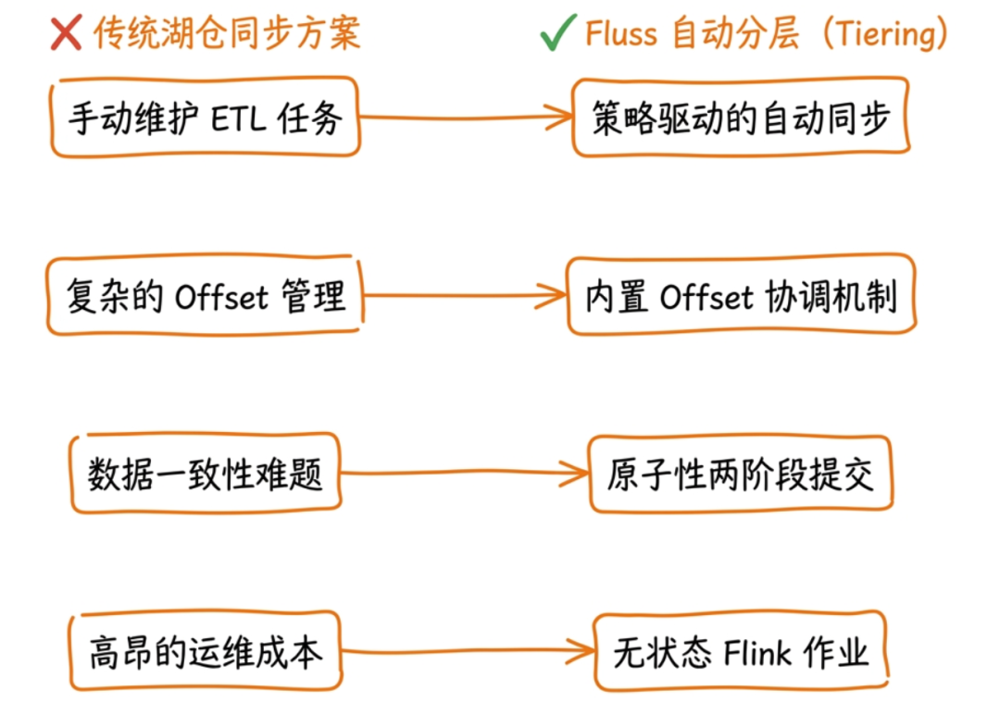

### 5.1 基于 Fluss 湖流一体的架构设计

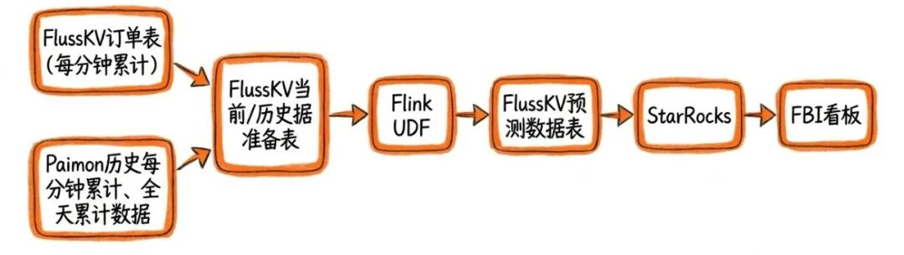

目前实现思路是采用 Fluss KV Table 作为流批统一存储，结合湖流一体实现自动化湖仓同步，流批操作基于同一 KV Table，天然实现数据一致性，同时消灭独立搬运 Job，实现预测结果的低延迟同步。核心架构流程： 

- 实时订单流写入 Fluss KV Table，实现每分钟滚动的累计订单量计算（流读）； 
- Flink UDF 直接从 Fluss KV Table 读取实时数据和历史基线数据（批读 / Snapshot Lookup），实现流批数据的高效融合； 
- 模型预测结果写入 Fluss KV Table，开启自动 Tiering，实现预测结果向 Paimon 的低延迟同步（快照周期可配）； 
- 下游算法模型和运营看板从 Fluss KV Table 读取实时预测结果，从 Paimon 读取历史预测结果，实现全链路数据一致。
### 5.2 核心 DDL 实现与写入实现

-- 注：文中 ${xxx} 为环境相关参数，实际部署需根据集群规模与数据量评估。

-- 1. 实时订单分钟累计流
CREATE TABLE `fluss_catalog`.`db`.`order_dtm`
(
  `ds` STRING comment '天',
  `mm` STRING comment '分钟',
  `order_source` STRING comment '订单来源',
  `order_cnt` BIGINT comment '订单量',
   PRIMARY KEY (ds,mm,order_source) NOT ENFORCED
)
COMMENT '实时订单分钟累计流'
PARTITIONED BY (ds)
WITH (
  'bucket.key' = 'mm,order_source',
  'bucket.num' = '${BUCKET_NUM}',
  'table.auto-partition.enabled' = 'true',
  'table.auto-partition.time-unit' = 'day',
  'table.auto-partition.key' = 'ds',
  'table.auto-partition.num-precreate' = '0', -- 预创建未来分区的数量。
  'table.auto-partition.num-retention' = '2', -- 保留最近 N 个分区，自动删除更老的分区。
  'table.replication.factor' = '${REPLICATION_FACTOR}',
  'table.log.arrow.compression.type' = 'zstd'
);

-- 2. 订单预估流（Fluss 湖流一体）
CREATE TABLE `fluss_catalog`.`db`.`order_forecast_mm`
(
  `ds` STRING COMMENT '日期分区字段（格式：yyyymmdd）',
  `mm` STRING COMMENT '分钟，格式 HH:mm 或 HHmm',
  `order_source` STRING COMMENT '订单来源',
  `cumulative_order_cnt` BIGINT COMMENT '截至当前分钟的累计订单量',
  `forecast_daily_order_cnt` STRING COMMENT '基于历史占比预测的全天24小时订单总量',
  PRIMARY KEY (ds, mm, order_source) NOT ENFORCED
)
COMMENT '订单预估流'
PARTITIONED BY (ds)
WITH (
  'bucket.key' = 'mm,order_source',
  'bucket.num' = '${BUCKET_NUM}',
  'table.auto-partition.enabled' = 'true',
  'table.auto-partition.time-unit' = 'day',
  'table.auto-partition.key' = 'ds',
  'table.auto-partition.num-precreate' = '0',
  'table.auto-partition.num-retention' = '2',
  'table.replication.factor' = '${REPLICATION_FACTOR}',
  'table.log.arrow.compression.type' = 'zstd',
  'table.datalake.enabled' = 'true', -- 是否启用湖流一体
  'table.datalake.freshness' = '30s' -- 控制湖表新鲜度
);

-- 3.实时增量与离线特征融合：利用 Flink Temporal Join 将 Fluss 实时流与paimon历史基线表关联，并通过 UDF 完成预测计算
CREATE TEMPORARY FUNCTION predict_hour_gmv AS 'com.example.flink.udf.FutureHourlyForecastUDF';

CREATE TEMPORARY VIEW trd_item_order AS
SELECT
  ds
  ,mm
  ,order_source
  ,order_cnt
  ,PROCTIME() AS proc_time
from `fluss_catalog`.`db`.`order_dtm`
;

INSERT INTO `fluss_catalog`.`db`.`order_forecast_mm`
SELECT
    t1.ds,
    t1.mm,
    t1.order_source,
    t1.order_cnt AS cumulative_order_cnt,
    predict_hour_gmv(
        COALESCE(t1.order_cnt,0), 
        t1.mm,                  
        t2.minute_ratio_feat    
    ) AS forecast_hour_order_cnt
FROM
    trd_item_order t1
LEFT JOIN paimon_catalog.db.order_mm_his_str /*+ OPTIONS(
    'scan.partitions' = 'max_pt()',
    'lookup.dynamic-partition.refresh-interval' = '1 h'
) */
FOR SYSTEM_TIME AS OF t1.proc_time AS t2 ON t1.order_source = t2.channel_id
;
### 5.3 落地效果量化

Fluss KV 湖流一体方案实现了流批数据的同源融合，消灭了独立搬运 Job，核心指标实现大幅优化：

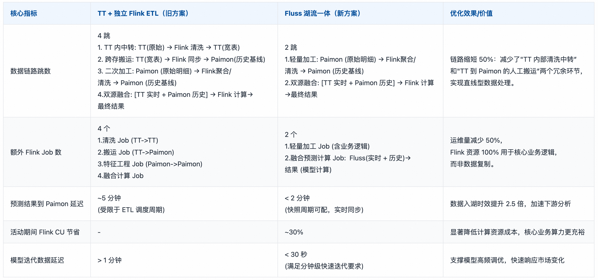

---

## 六、场景4：灰度监控 —— Log Table + 列裁剪实现高效日志处理

在淘宝闪购高频迭代的业务背景下，前端埋点数据（涵盖用户进端、进站、曝光、引流、进店、加购、下单、履约等全链路行为）是评估版本质量、监控营销效果及优化搜推策略的核心依据。为降低发版风险，灰度发布已成为标准流程，而灰度监控则是其中的“安全阀”，旨在通过实时分析灰度流量与基线流量的差异，秒级发现采集异常或业务逻辑缺陷。然而，面对 TB 级的日志吞吐量和毫秒级的报警需求，传统基于"TT+Flink"的架构逐渐显露出 IO 浪费严重、链路冗余、多源数据孤岛等瓶颈。Fluss 凭借 Log Table 的高吞吐写入能力、服务端列裁剪的IO 优化以及湖流一体的自动归档机制，重构了灰度监控的数据底座，实现了从“被动救火”到“主动治理”的架构升级。

### 6.1 传统方案痛点

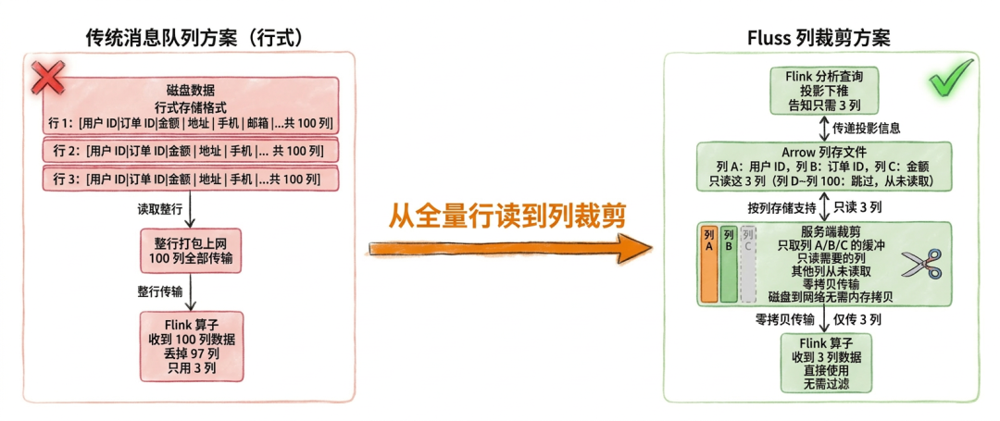

旧方案采用 TT 作为消息队列，Flink 进行实时消费计算，Paimon 存储明细数据。随着数据量激增和业务复杂度提升，该架构暴露出几大核心痛点：

维度	          具体技术挑战
IO 资源浪费      TT 为行存储，
                且不支持服务端列裁剪。
                监控任务仅需 30 个核心字段，
                却需拉取包含 args 
                等大字段的整行数据（90+ 列）。

链路冗余复杂      需维护两套独立 Flink Job：
                一套用于实时监控报警，
                一套用于数据清洗后写入 Paimon。
多源数据孤岛      多端灰度日志各自为政，处理逻辑分散。

### 6.2 基于 Fluss Log Table + 列裁剪的架构设计

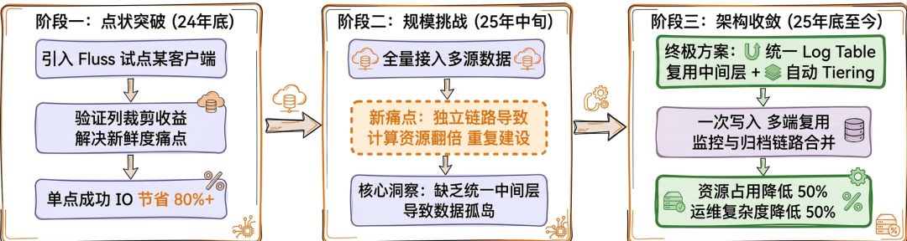

针对上述痛点，淘宝闪购经历了三个阶段的架构演进，最终确立了以 Fluss 为核心的统一日志治理方案：

- 阶段一： 引入 Fluss 试点某客户端数据，验证成本优化与新鲜度提升可行性。
- 阶段二： 全量接入多端数据，虽实现采集统一，但因中间层复用困难，计算任务仍有冗余。
- 阶段三： 利用Fluss列裁剪消除无效 IO，通过自动 Tiering 合并监控与同步链路，彻底解决重复计算问题。
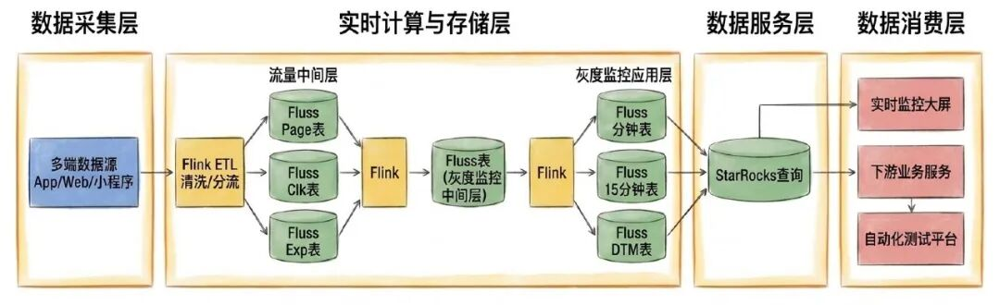

新架构以 Fluss Log Table 为唯一事实来源，构建“一次写入、多维复用”的高效闭环：

- 统一高吞吐摄入：多源灰度日志统一写入 Fluss Log Table。利用 Log Table 的 Append-Only 特性，完美适配海量日志的高并发写入场景。
- 服务端列裁剪（Server-side Column Pruning）：Flink 消费时，通过 Projection Pushdown 将所需列下推至 Fluss 服务端。服务端仅读取并返回指定的 30 个核心字段，从源头阻断 67% 的无效网络传输。
- Fluss 湖流一体自动归档：只需开启 table.datalake.enabled 配置，系统即可自动将实时数据异步同步至 Paimon。无需部署额外的 Flink 归档任务，实时监控与离线分析共用同一套数据链路，真正实现流批数据的无缝融合。
- 多端复用与秒级报警：实时监控任务直接消费裁剪后的轻量级数据流，对接 FBI 看板实现秒级异常报警；离线分析直接查询 Paimon 表，确保流批数据天然一致。
### 6.3 核心 DDL 实现与写入实现

核心 DDL 实现创建灰度日志 Log Table，开启列裁剪和自动 Tiering，适配多源日志采集与归档需求：

-- 注：文中 ${xxx} 为环境相关参数，实际部署需根据集群规模与数据量评估。

CREATE TABLE `fluss_catalog`.`db`.`log_page_ri`
(  
  `col1` STRING,
  `col2` STRING,
  `col3` STRING,
  `col4` STRING
  -- ....... 中间若干字段省略
  ,ds STRING
)
COMMENT '访问日志流'
PARTITIONED BY (ds) --分区字段在上面定义
WITH (
  'bucket.num' = '${BUCKET_NUM}',
  'table.auto-partition.enabled' = 'true',
  'table.auto-partition.time-unit' = 'day',
  'table.auto-partition.key' = 'ds',
  'table.auto-partition.num-precreate' = '0', 
  'table.auto-partition.num-retention' = '1',
  'table.log.ttl' = '${LOG_TTL}',
  'table.replication.factor'='${REPLICATION_FACTOR}',
  'table.log.arrow.compression.type' = 'zstd',
  'table.datalake.enabled' = 'true', -- 是否启用湖流一体
  'table.datalake.freshness' = '3min' -- 控制湖表新鲜度
)
;

-- 监控查询（仅读取30列核心字段，触发服务端列裁剪）
INSERT INTO `fluss_catalog`.`db`.ads_gray_monitoring_ri /*+ OPTIONS('client.writer.enable-idempotence'='false') */
SELECT
    col1,
    col2,
    col3,
    col4,
    -- ......... 中间若干字段省略
    ds
FROM `fluss-ali-log`.`db`.`log_page_ri`
WHERE KEYVALUE(`args`, ',', '=', 'release_type') = 'grey' -- 灰度标
;

-- Flink Cube聚合
INSERT INTO `fluss_catalog`.`db`.ads_gray_monitoring_permm_ri /*+ OPTIONS('client.writer.enable-idempotence'='false') */
SELECT
    col1,
    col2,
    col3,
    col4,
    count(*) AS pv,
    -- ......... 中间若干字段省略
    ds
FROM `fluss_catalog`.`db`.ads_gray_monitoring_ri
GROUP BY
GROUPING SETS (
  (ds, col1, col2, col3......),
  (ds, col1, col2......),
  (ds, col1, ......)
)
;
### 6.4 落地效果量化

Fluss Log Table + 列裁剪方案实现了灰度日志的高效处理与统一管理，核心指标大幅优化：
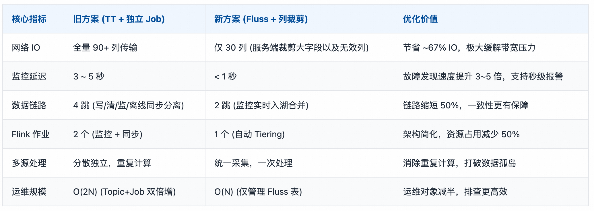

---

## 七、场景5：全域实时 UV 统计——自增列与 Agg Table 解决海量去重瓶颈

在淘宝闪购的精细化运营体系中，曝光、访问、点击、下单等全链路行为的独立访客数（UV）是衡量流量质量与转化效率的核心指标。在早期的架构实践中，我们采用了 Flink + Hologres + Paimon + StarRocks 的混合架构：利用 Hologres 存储用户映射表以解决 ID 转换，Flink 通过 自定义UDF 构建 Bitmap 并写入 Paimon，最后由 StarRocks 物化视图加速查询。然而，在超大规模数据场景下，该架构暴露出 Hologres Lookup 热点瓶颈、Flink State 膨胀导致反压、Paimon 同步延迟高 三大核心痛点，难以满足活动期间秒级实时监控的需求。Fluss 的引入是对这一架构的关键迭代：利用 Fluss KV Table 替代 Hologres 实现低延迟 ID 映射，利用 Fluss Agg Table 替代 Flink State 实现无状态局部聚合，利用 Auto Tiering 替代 Paimon 独立链路实现秒级同步。这一方案实现了从多组件拼接、高延迟到流批一体、低延迟的架构升级。

### 7.1 传统方案痛点

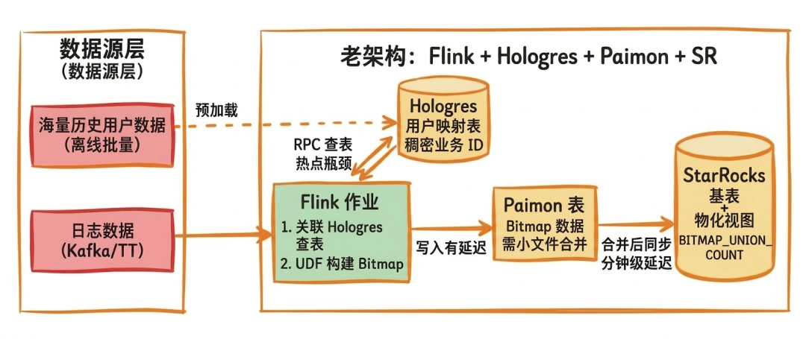

在迭代前的架构中，主要存在以下瓶颈：

- Hologres Lookup 热点与网络瓶颈：Flink 对 Hologres发起海量 RPC 请求，在高并发下易出现热点倾斜，Lookup 延迟劣化至秒级。
- Flink State 膨胀与 Checkpoint 失败：Flink UDF 需维护 TB 级 Bitmap State，Checkpoint 耗时过长（>10分钟），频繁超时，作业稳定性差。
- Paimon 同步延迟：Paimon Compaction 引入分钟级延迟，导致下游 SR MV 数据新鲜度不足，无法满足秒级监控需求。
### 7.2 基于 Fluss 自增列 + Agg Table 的架构设计

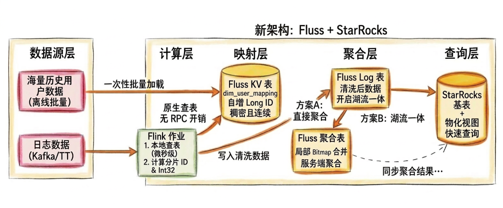

针对传统架构的三大痛点，依托Fluss的核心设计，以“将稀疏业务 ID 转化为稠密物理 ID 位图”为切入点。通过全量映射预加载、自增 ID 稠密化、分片并行与32位 Bitmap优化等实践，实现高性能实时 UV 统计。

- 自增列 KV 映射层：依托 Flink 原生 KV 索引驱动，构建实时维度关联能力
- 无锁化号段分配：Fluss 采用本地缓存 ID 分片按需批量申请机制。线程级无锁分配有效避免了并发写入时的锁竞争与 GC 抖动，ID 生成性能得到显著优化。
- 查询即插入：在维表 Lookup 场景中，若业务 ID 未命中，Fluss 自动触发 INSERT 并返回自增 ID。Fluss该机制将传统“先查后写”的两次交互合并为单次请求，有效降低网络流量消耗及集群压力。
- Batching & Pipeline 优化：结合 Flink 异步 Lookup 的批量请求机制与 Fluss 客户端的 Pipeline 写入，将海量离散 RPC 聚合并行处理。Fluss该设计有效降低交互开销，系统整体吞吐能力得到进一步优化。
- 全量预加载与 ID 稠密化：上线前将数十亿历史业务 ID 批量导入 Fluss KV Table（字典表），利用自增列生成唯一的 64 位物理 ID。此举可消除跨集群 RPC 延迟，历史用户 100% 命中映射表，新用户首次出现时动态 INSERT 分配 ID。
- 分片并行：通过物理 ID 取模将全量用户均匀打散至 N 个逻辑分片，实现全局去重任务的局部化并行。同一用户行为严格落入同一分片，各分片数据量绝对均衡，彻底避免业务 ID 号段规律导致的热点倾斜；
- 32 位降维压缩：当物理 ID 总数小于 40 亿时，可将 64 位 ID 映射压缩为 32 位整数，并启用 rbm32 聚合函数。相比 rbm64，该方案内存占用减少 50% 以上，且位运算效率与 CPU 缓存命中率显著提升。
#### 7.2.1 双路径聚合架构

基于上述预处理，团队落地两条并行链路：

- 方案 A（Fluss Agg Table 预聚合）：服务端按 (ds, hh, mm, shard_id) 完成局部 Bitmap 合并，Flink 仅消费聚合结果。适用于活动作战室等极致实时场景（亚秒级延迟），计算压力下沉至存储层；
- 方案 B（Fluss Auto Tiering + StarRocks 原生去重）：明细数据秒级同步至 Paimon，由 StarRocks 承担最终去重。适用于日常运营看板等灵活多维分析场景，支持任意维度即席查询。
两条路径共享同一套 ID 映射与分片逻辑，团队可根据业务对“实时性”与“查询灵活性”的诉求自由切换。

### 7.3 核心 DDL 实现与写入实现

#### 7.3.1 用户映射表（开启自增列）

-- 注：文中 ${xxx} 为环境相关参数，实际部署需根据集群规模与数据量评估。

CREATE TABLE `fluss_catalog`.`db`.`user_mapping_table` (
  user_id BIGINT COMMENT '原始用户ID',
  uid_int64 BIGINT COMMENT '自增生成的全局唯一整数ID', 
  update_time TIMESTAMP(3) COMMENT '更新时间',
  PRIMARY KEY (user_id) NOT ENFORCED
) WITH (
  'bucket.key' = 'user_id',
  'bucket.num' = '${BUCKET_NUM}',
  'auto-increment.fields' = 'uid_int64', -- 开启自增列
  'table.log.arrow.compression.type' = 'zstd'
);
#### 7.3.2 新用户发现与映射写入

INSERT INTO `fluss_catalog`.`db`.`user_mapping_table` (user_id) 
SELECT /*+ REPLICATED_SHUFFLE_HASH(t2) */ 
  t1.user_id
FROM `fluss_catalog`.`db`.`log_exp_ri` t1
LEFT JOIN `fluss_catalog`.`db`.`user_mapping_table` 
 /*+ OPTIONS(
    'lookup.insert-if-not-exists' = 'true',
    'lookup.cache' = 'PARTIAL',
    'lookup.partial-cache.max-rows' = '500000',
    'lookup.partial-cache.expire-after-write' = '1h',
    'lookup.partial-cache.cache-missing-key' = 'false'
) */
FOR SYSTEM_TIME AS OF PROCTIME() AS t2 
ON t1.user_id = t2.user_id
GROUP BY t1.user_id;
#### 7.3.3 方案A实现：Fluss Agg Table + Flink Global Merge

核心思路：利用 Fluss Agg Table 在服务端完成局部 Bitmap 合并，Flink 仅消费聚合结果进行全局 Merge。

Fluss DDL (Agg Table)

-- 注：文中 ${xxx} 为环境相关参数，实际部署需根据集群规模与数据量评估。

CREATE TABLE IF NOT EXISTS `fluss_catalog`.`db`.`ads_uv_agg` (
    ds STRING COMMENT '日期分区 yyyyMMdd',
    hh STRING COMMENT '小时 HH',
    mm STRING COMMENT '分钟 mm',
    shard_id int COMMENT '分片',
    uv_bitmap BYTES COMMENT '分钟级用户位图',
    PRIMARY KEY (ds, hh, mm, shard_id) NOT ENFORCED
) 
PARTITIONED BY (ds)
WITH (
    'bucket.key' = 'shard_id',
    'bucket.num' = '${BUCKET_NUM}',
    'table.merge-engine' = 'aggregation',  -- 开启聚合引擎，否则 Bytes 字段无法自动合并
    'fields.uv_bitmap.agg' = 'rbm32', -- 指定 Bytes 字段使用 rbm32 算法进行 Union 聚合
    'table.auto-partition.enabled' = 'true',
    'table.auto-partition.time-unit' = 'day',
    'table.auto-partition.key' = 'ds'
);
Fluss DML (Agg Table)

-- 注意：其中 N 为 2 的幂次方，根据集群规模动态配置

INSERT INTO fluss_catalog.db.ads_uv_agg
SELECT
  t1.ds 
  ,t1.hh 
  ,t1.mm 
  ,CAST(t2.uid_int64 % N AS INT) AS shard_id
  ,BITMAP_TO_BYTES(BITMAP_BUILD_AGG(CAST((t2.uid_int64 / N) AS INT))) AS uv_bitmap
FROM `fluss_catalog`.`db`.`log_exp_ri` t1
LEFT JOIN `fluss_catalog`.`db`.`user_mapping` 
  /*+ OPTIONS('lookup.cache' = 'PARTIAL','lookup.partial-cache.max-rows' = '500000') */
  FOR SYSTEM_TIME AS OF PROCTIME() AS t2 
ON t1.user_id = t2.user_id
GROUP BY t1.ds, t1.hh, t1.mm, CAST(t2.uid_int64 % N AS INT)
;
特点：Flink 无 State，延迟极低。

#### 7.3.4 方案B实现：Fluss Tiering + StarRocks Native Bitmap（灵活查询）

核心思路：Fluss 作为高质量数据管道，通过 Auto Tiering 将数据同步至 paimon，利用 SR 强大的 OLAP 引擎进行最终去重。

Fluss DDL (Log/KV Table with Tiering)：

CREATE TABLE fluss_catalog.db.ads_uv_detail (
    ds STRING,
    -- ....... 中间若干字段省略
    shard_id INT,
    uid_int32 INT,
    PRIMARY KEY (ds, shard_id, uid_int32) NOT ENFORCED
) WITH (
    'table.datalake.enabled' = 'true', -- 开启湖流一体
    'table.datalake.freshness' = '10s' -- 秒级同步
);
事实表打宽（生成 Shard 与 Bitmap Index）

-- 注意：其中 N 为 2 的幂次方，根据集群规模动态配置
INSERT INTO fluss_catalog.db.ads_uv_detail
SELECT
  t1.ds,
  -- ....... 中间若干字段省略
  CAST(t2.uid_int64 % N AS INT) AS shard_id,      -- 分片编号，用于并行聚合
  CAST((t2.uid_int64 / N) AS INT) AS uid_int32   -- 压缩后的ID，用于Bitmap
FROM `fluss_catalog`.`db`.`log_exp_ri` t1
LEFT JOIN `fluss_catalog`.`db`.`user_mapping` 
  /*+ OPTIONS('lookup.cache' = 'PARTIAL','lookup.partial-cache.max-rows' = '500000','lookup.partial-cache.expire-after-access' = '2min') */
  FOR SYSTEM_TIME AS OF PROCTIME() AS t2 
ON t1.user_id = t2.user_id;
下游 StarRocks 精确去重查询

-- 注：文中 ${xxx} 为环境相关参数，实际部署需根据集群规模与数据量评估。

-- 创建物化视图加速查询
CREATE MATERIALIZED VIEW mv_global_uv AS
SELECT 
  t.ds,
  SUM(t.rb_partial) as rbm_user_count -- 全局合并各分片的局部Bitmap
FROM (
  SELECT 
    ds,
    shard_id, 
    BITMAP_UNION_COUNT(TO_BITMAP(uid_int32)) as rb_partial -- 局部Bitmap计数
  FROM 
    paimon_catalog.db.ads_uv_detail
  WHERE 
    ds = '${date}'
  GROUP BY 
    ds, shard_id
) t
GROUP BY t.ds;
特点：架构解耦，SR 承担计算压力，支持灵活即席查询。

### 7.4 落地效果量化

相较于老方案，两种新方案均实现了显著优化，但侧重点不同：

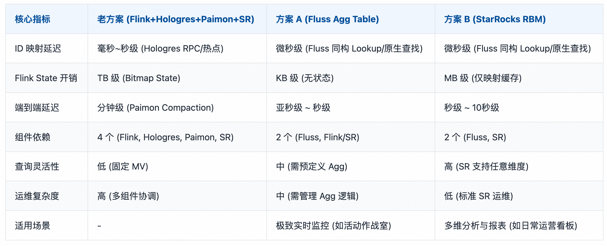
- 若业务追求极致的实时性且聚合逻辑固定，推荐方案A，它将计算压力最大程度下沉至存储层。
- 若业务需要灵活的多维分析且对秒级延迟可接受，推荐方案B，它充分利用了 StarRocks 的 OLAP 能力，架构更简洁通用。
通过这两种方案，淘宝闪购成功在超大规模数据场景下，实现了全链路 UV 指标的实时、精确、低成本统计，既保留了 StarRocks 的查询优势，又通过 Fluss 解决了上游链路的性能瓶颈。

---

## 八、Fluss 落地经验沉淀与未来规划

淘宝闪购在 Fluss 落地过程中，完成了从单特性试点到多特性协同的全链路实践，积累了可复制的落地经验，同时结合业务需求和社区发展制定了明确的未来规划。 

### 8.1 核心落地经验

- DDL 规范先行：宽表建表时需提前规划各列的负责 Job，所有非主键列必须声明为NULLABLE，写入方仅指定目标列，该规范需固化至团队建表流程，避免因字段配置不当导致更新失败； 
- 分桶策略精准化：分桶数过少会导致单 Bucket 数据量过大、RocksDB 读放大；
- 最大化列裁剪收益：业务 SQL 需明确指定所需列，避免全字段查询，尤其在日志宽表、维表关联场景，最大化发挥 Fluss 的 IO 节省优势； 
- 渐进式迁移：无需一次性替换全部传统链路，可从Delta Join 替换双流join大State开始，逐步扩展到 Partial Update 宽表和湖流一体，每一步都有独立量化收益，验证效果后再推广。
### 8.2 未来规划

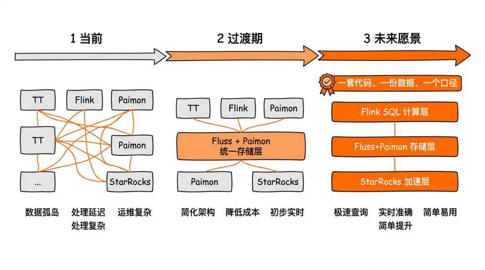

未来，整体数据架构将逐步通过 Flink SQL 统一计算逻辑，依托 Fluss + Paimon 演进为湖流一体存储底座，借助 StarRocks 构建统一查询加速层。最终旨在达成一套代码、一份数据、一个口径，同时服务实时应用与离线分析，彻底解决流批割裂导致的数据不一致与高维护成本问题。

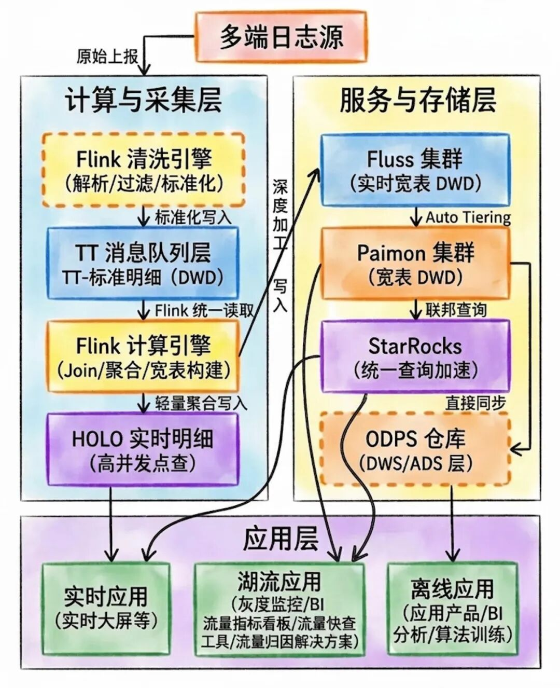

欢迎 star 和加入 Apache Fluss 贡献：https://github.com/apache/fluss/

欢迎加入"Fluss 社区交流群"群的钉钉群号：109135004351
